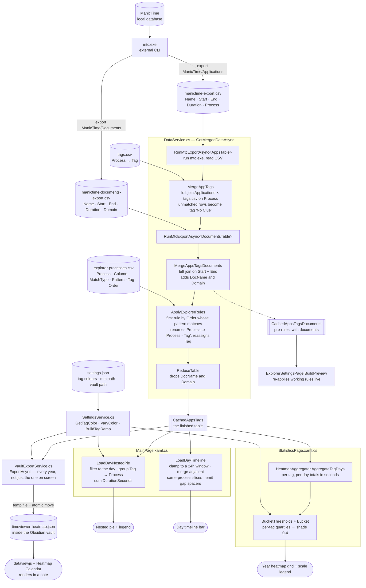
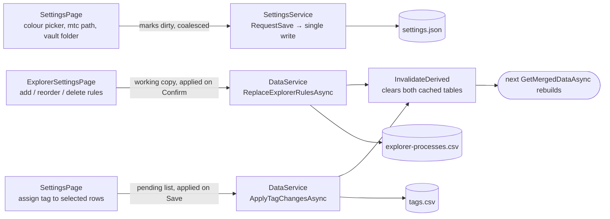

# TimeViewer — Architecture

How a row of ManicTime data becomes a pie slice, a bar on the timeline, a cell in a heatmap and a
number in an Obsidian vault — and which file is responsible for each step.

TimeViewer never talks to ManicTime's database directly. It shells out to `mtc.exe`, reads the two
CSVs it writes, and joins them against two small files the user owns. Everything downstream is a
pure transformation of those four inputs.

---

## The read path

## The write path

Every user edit lands in a file, and both edits invalidate the derived caches so the next read
rebuilds from disk. Nothing mutates the cached tables in place.

---

## File map

### Services

| File | Owns |
|---|---|
| `Services/DataService.cs` | The whole read pipeline, the four caches, and the two CSVs the user edits. Serialises every read and write behind one `SemaphoreSlim`. Exposes `KnownTags` — the single answer to "which tags exist". |
| `Services/SettingsService.cs` | `settings.json`. Tag colours, including auto-assigning one to a tag it has not seen. Colour maths: `VaryColor` for the pie's per-process shades, `BuildTagRamp` for the heatmap's pale-to-saturated ramp. Writes are coalesced and serialised. |
| `Services/HeatmapAggregator.cs` | Per-tag / per-day totals, the quartile shade buckets and the legend labels. Deliberately shared by the Statistics chart and the vault export, so the grid, the legend and the exported file cannot disagree. Owns `MinTrackedSeconds`. |
| `Services/VaultExportService.cs` | Writes `timeviewer-heatmap.json` into the Obsidian vault. Temp file plus atomic move, because Dataview watches the folder and can read mid-write. Never creates the folder — a stale path is reported, not silently recreated. |
| `Services/Secrets.cs` | Syncfusion licence key. Gitignored; copy `Secrets.cs.example` and fill it in. |

### Pages

| File | Owns |
|---|---|
| `Pages/MainPage.xaml{,.cs}` | The nested pie, its legend, the day timeline bar and its hover panel. Day navigation, the 5-minute auto-refresh, the always-on-top pin. `LoadDayTimeline` must run after `LoadDayNestedPie` — it reads the `_processColors` map that one fills. |
| `Pages/StatisticsPage.xaml{,.cs}` | One GitHub-style year heatmap per tag, its scale legend, year navigation, and the "Export to Vault" button. Builds each series and both axes in code-behind because their labelers close over the year's calendar. |
| `Pages/SettingsPage.xaml{,.cs}` | Tag colours, the process/tag grid, tag assignment, the `mtc.exe` path and the vault folder. Also defines `TagColorRow` and `ProcessRow`. |
| `Pages/ExplorerSettingsPage.xaml{,.cs}` | Explorer rule editing for one process, with a live preview grid. Edits a **copy** of the rules so Cancel genuinely discards. Also defines `ExplorerPreviewRow`. |

### Models

| File | Contents |
|---|---|
| `Models/DataModels.cs` | `TagsTable`, `AppsTable`, `DocumentsTable`, `AppsTagsTable`, `AppsTagsDocumentsTable`, `ExplorerRule`. Every timed row exposes `DurationSeconds`. |
| `Models/ChartModels.cs` | `PieData`, `TimelineData`, `TimelineSlice`, `LegendItem`, `TagDailyTotals`, `TagYearHeatmap`, `HeatmapScaleStep`. |
| `Models/AppSettings.cs` | The shape of `settings.json`. |
| `Models/SortComparers.cs` | `IUsageStats` and the two grid sort comparers, shared by both data grids. |

### Shell and platform

| File | Owns |
|---|---|
| `MauiProgram.cs` | DI registration. `SettingsService`, `DataService` and `VaultExportService` are singletons; every page is transient. |
| `App.xaml{,.cs}` | Syncfusion licence registration, merged resource dictionaries. |
| `AppShell.xaml{,.cs}` | Shell root plus the three navigation routes. |
| `Platforms/Windows/WindowService.cs` | Always-on-top, via a `SetWindowPos` P/Invoke. |

### Runtime file locations

| What | Where |
|---|---|
| Settings | `FileSystem.AppDataDirectory/settings.json` |
| Tags | `FileSystem.AppDataDirectory/tags.csv` |
| Explorer rules | `FileSystem.AppDataDirectory/explorer-processes.csv` |
| mtc.exe export cache | `FileSystem.CacheDirectory/manictime-export.csv`, `…-documents-export.csv` |
| Vault export | `SettingsService.ObsidianExportPath/timeviewer-heatmap.json` — the only file written outside the app's own sandbox |

---

## Invariants every view shares

These are the rules that let four different views agree about the same day. Each has exactly one
owner; nothing repeats the value.

| Rule | Owner | Why |
|---|---|---|
| **Activities under 30 seconds are ignored.** | `HeatmapAggregator.MinTrackedSeconds` | Window-title churn produces a long tail of 1-5 second rows. The pie, the timeline and the heatmap all reference this constant, so they cannot drift apart. |
| **An activity crossing midnight counts wholly toward the day it started on.** | `Start.Date` grouping, in `LoadDayNestedPie` and `AggregateTagDays` | Splitting it would be more accurate and much harder to reason about. The timeline is the exception: it clamps to its window, because it draws clock positions rather than totals. |
| **`DurationSeconds` is `End - Start`.** | `Models/DataModels.cs` | Verified identical to ManicTime's own `Duration` string across all 86,398 rows of the reference export. Computing it removes ~450k `TimeSpan.Parse` calls per Statistics refresh and the ambient-culture dependency that came with them. |
| **Shades are per-tag, per-year quartiles.** | `HeatmapAggregator.BucketThresholds` | A dark cell means "a heavy day *for this tag*", not a fixed number of hours, so a light-usage tag still shows a full range. The thresholds are exported alongside the data so a note can label its own legend correctly. |
| **Caches are invalidated, never patched.** | `DataService.InvalidateDerived` | Both cached tables are derived from `tags.csv` and `explorer-processes.csv`, so editing either makes both stale. Every mutator routes through one method rather than remembering which pair to clear. |

## Gotchas worth knowing before changing a chart

- **The timeline cannot be hit-tested by LiveCharts.** Every segment is its own stacked series, and
  a stacked point's hover area is a sliver at its trailing edge rather than the drawn bar. The
  pointer is scaled back to a time and matched against `_timelineSlices` instead.
- **Assigning an axis limit of `0` does nothing.** It is the axis's own default, so it raises no
  change notification and the axis auto-scales anyway. `MainPage` writes `-1` first; the heatmap
  axes sidestep it by using `-0.5`.
- **Cartesian series have no `ToolTipLabelFormatter`** — that is pie-only. Use
  `XToolTipLabelFormatter` / `YToolTipLabelFormatter`.
- **The legend's rows are 24px only because WinUI's 40px `GridViewItem` minimum is lifted** in the
  `MainPage` constructor. Without that override every row's bottom is clipped.
