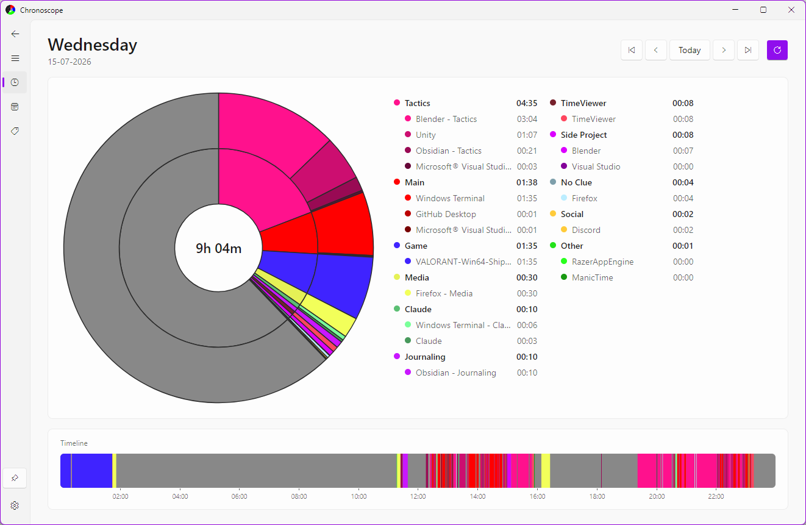
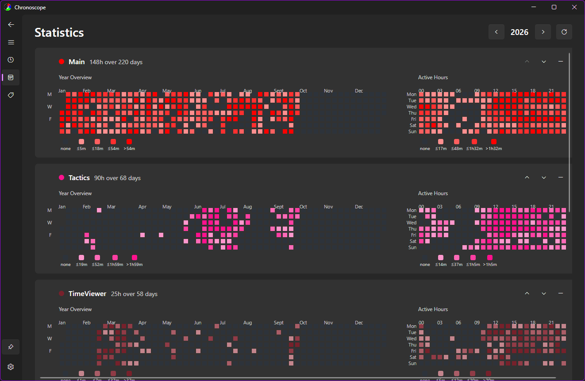
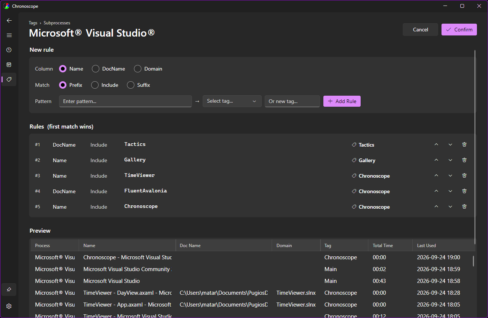
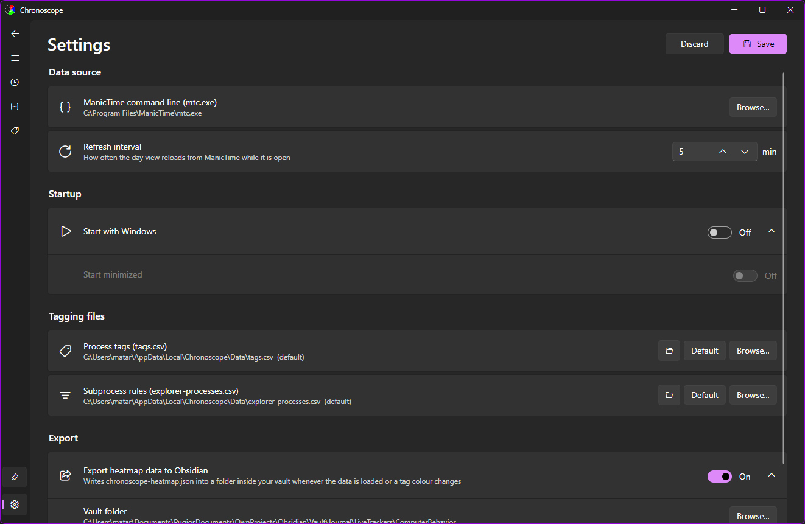

# Chronoscope

**See where your time on the PC actually goes, grouped the way *you* think about it.**

<picture>
  <source media="(prefers-color-scheme: dark)" srcset="./pics/CS1.png">
  
</picture>

I find it fascinating to discover patterns in everything, including my own life. Chronoscope is the tool I built to observe my own behaviour and understand how I really spend each day at the computer.

It sits on top of [ManicTime](https://www.manictime.com/), which quietly records the active window all day. ManicTime's own views are great for tracking how much time to bill a client for a project. But, they are not helpful for quickly answering **"How did I spend my day today?"**

Chronoscope answers exactly that question! Sort every app into your own categories once, and from then on see when you do what.

> **Chronoscope needs ManicTime.** It reads ManicTime's data through its command line tool
> (`mtc.exe`), so ManicTime has to be installed and tracking for Chronoscope to show anything.

## Getting started

1. Install [ManicTime](https://www.manictime.com/) and let it track for a while.
2. Download `ChronoscopeSetup.exe` from the [latest release](https://github.com/Pugios/Chronoscope/releases/latest) and install it. Windows 10 (1809) or later, x64. 
3. In **Settings**, check the path to `mtc.exe` (the default is `C:\Program Files\ManicTime\mtc.exe`).
4. Open **Tags**, sort the table by Total Time and start tagging your biggest apps. Anything you haven't tagged yet is counted under **No Clue**, so there's no need to do it all at once.


## Features

### Year Overview


- a GitHub-style heatmap card per tag for the whole year, one cell per day
- a weekday $\times$ hour grid showing *when* in the week you spend time on that tag
- Every card has its own legend with the real durations behind each shade
- Reorder the cards, or hide tags you don't care about

### Create your Tags


- Search by process or tag and assign an existing or new tag
- Pick each tag's colour with a full colour picker

### Create Subprocess Rules


Some apps are used for many things: a browser can be work or YouTube, an editor can be one project or another. For those, you can split the app by **what it had open**:

- Match on the window name, the document name or the domain, by prefix, substring or suffix
- Rules are ordered and the first match wins. Reorder them any time
- A **live preview** shows exactly which activities each rule catches

### Settings


- Point Chronoscope at `mtc.exe` and choose the refresh interval
- Choose to Start with Windows Startup
- Keep `tags.csv` and `explorer-processes.csv` wherever you like, for example in a synced folder shared between machines
- All your data stays on your machine: plain CSV and JSON files you can read, edit and back up
- **Obsidian export**: write per-tag heatmap data into your vault on every refresh, with the time of the last export (or the reason it failed) shown right here. [More below](#obsidian-heatmap-export)
- **Keep on top** pin, handy for a small window in the corner of your screen

### Obsidian Heatmap Export

Chronoscope can write its per-tag heatmap data into an Obsidian vault, so the [Heatmap Calendar](https://github.com/Richardsl/heatmap-calendar-obsidian) community plugin can render a calendar per tag next to whatever else you already track there.

Enable it in **Settings**, just pick a folder inside your vault. Chronoscope then rewrites `chronoscope-heatmap.json` there every time it loads data. 
Settings shows when the file was last written, or why the last attempt failed.

### Format

Values are **seconds**, covering every year in your ManicTime data. `ramp` is the tag's own colour ramp as the app draws it, pale to saturated.
`thresholds` are the cut points between shades, **per year**, so a note can colour days exactly the way the app does and label what each shade means.

```json
{
  "generatedAt": "2026-09-18T14:02:11+02:00",
  "unit": "seconds",
  "tags": {
    "Work": {
      "color": "#1872FF",
      "ramp": ["#99c1ff", "#6ea6ff", "#438cff", "#1771ff"],
      "thresholds": { "2026": [3600, 7200, 18000] },
      "days": { "2026-03-04": 10830, "2026-03-05": 10800 }
    }
  }
}
```
Dark cells mean *a heavy day for that tag*, not a fixed number of hours, so drawing the legend below it worth. The scale differs between tags!

Paste into any note, set `tag` and `year` to taste. This reproduces the app's own buckets, so the note and the Statistics page agree cell for cell.

````markdown
```dataviewjs
const path = "Chronoscope/chronoscope-heatmap.json"
const tag  = "Work"
const year = 2026

const data = JSON.parse(await dv.io.load(path))
const t    = data.tags[tag]
const th   = t.thresholds[year] ?? []

// Mirrors HeatmapAggregator.Bucket: the first step the day fits under.
const bucket = (seconds) => {
    if (seconds <= 0) return 0
    for (let i = 0; i < th.length; i++) if (seconds <= th[i]) return i + 1
    return 4
}

// Mirrors HeatmapAggregator.FormatDuration: "45m", "3h", "1h20m".
const fmt = (s) => {
    const h = Math.floor(s / 3600)
    const m = Math.floor((s % 3600) / 60)
    if (h === 0) return `${Math.max(m, 1)}m`
    return m === 0 ? `${h}h` : `${h}h${m}m`
}

const labels = ["none", ...[1, 2, 3, 4].map(i =>
    th.length === 0        ? (i === 4 ? "any" : "")
  : i - 1 < th.length      ? `≤${fmt(th[i - 1])}`
  :                          `>${fmt(th[th.length - 1])}`
)]

renderHeatmapCalendar(this.container, {
    year,
    colors: { [tag]: t.ramp },
    showCurrentDayBorder: true,
    // The intensity IS the bucket, so the four ramp colours line up with steps 1-4.
    intensityScaleStart: 1,
    intensityScaleEnd: 4,
    entries: Object.entries(t.days)
        .filter(([date]) => date.startsWith(String(year)))
        .map(([date, seconds]) => ({
            date,
            intensity: bucket(seconds),
            color: tag,
        })),
})

// Legend: one swatch per step, labelled with the span of time it stands for.
const legend = this.container.createEl("div", { attr: {
    style: "display:flex; align-items:flex-end; gap:6px; margin-top:10px; flex-wrap:wrap;"
}})

labels.forEach((label, i) => {
    const cell = legend.createEl("div", { attr: {
        style: "display:flex; flex-direction:column; align-items:center; gap:3px;"
    }})
    cell.createEl("div", { attr: {
        style: `width:22px; height:22px; border-radius:4px; background:${
            i === 0 ? "var(--background-modifier-border)" : t.ramp[i - 1]};`
    }})
    cell.createEl("span", { text: label, attr: { style: "font-size:10px; opacity:0.7;" } })
})

// Hover: the exact time behind a cell, for every tag that recorded something that day.
// The plugin stamps data-date on each box that has an entry and styles the boxes
// position:relative, so the tooltip can simply hang off the box. Built on first hover
// rather than up front, so a note with many tags does not create thousands of nodes.
const fmtLong = (s) => {
    // Round to whole minutes FIRST, or 59.9 minutes renders as "60 min" instead of "1 h".
    const mins = Math.round(s / 60)
    const h = Math.floor(mins / 60)
    const m = mins % 60
    if (h === 0) return `${Math.max(m, 1)} min`
    return m === 0 ? `${h} h` : `${h} h ${m} min`
}

const buildTooltip = (box, date) => {
    const tip = box.createEl("div", { attr: { style: `
        position:absolute; bottom:calc(100% + 6px); left:50%; transform:translateX(-50%);
        z-index:20; width:max-content; pointer-events:none; white-space:nowrap;
        padding:6px 8px; border-radius:6px; font-size:11px; line-height:1.5; text-align:left;
        background:var(--background-secondary); color:var(--text-normal);
        border:1px solid var(--background-modifier-border);
        box-shadow:0 2px 8px rgba(0,0,0,0.25);` }})

    tip.createEl("div", { text: date, attr: { style: "font-weight:600; margin-bottom:3px;" } })

    const row = tip.createEl("div", { attr: {
        style: "display:flex; gap:12px; justify-content:space-between;"
    }})
    row.createEl("span", { text: tag, attr: { style: "opacity:0.75;" } })
    row.createEl("span", { text: fmtLong(t.days[date]) })

    return tip
}

this.container.querySelectorAll(".heatmap-calendar-boxes li[data-date]").forEach(box => {
    box.addEventListener("mouseenter", () => {
        box._tip = box._tip ?? buildTooltip(box, box.dataset.date)
        box._tip.style.display = "block"
    })
    box.addEventListener("mouseleave", () => {
        if (box._tip) box._tip.style.display = "none"
    })
})
```
````

To list what is available instead of hardcoding a tag: `Object.keys(data.tags)`.