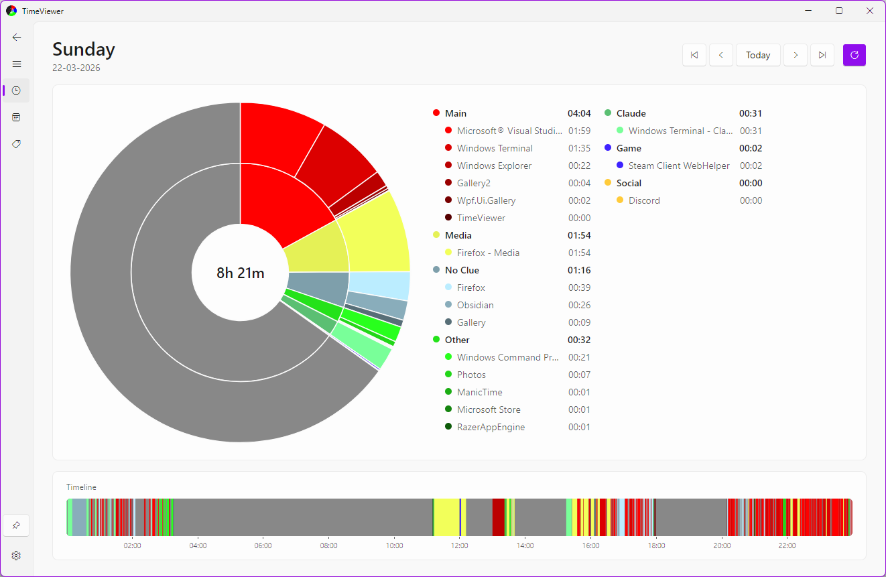
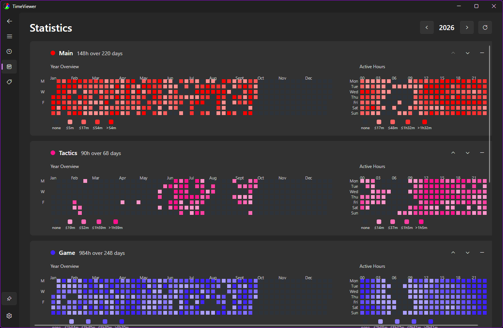
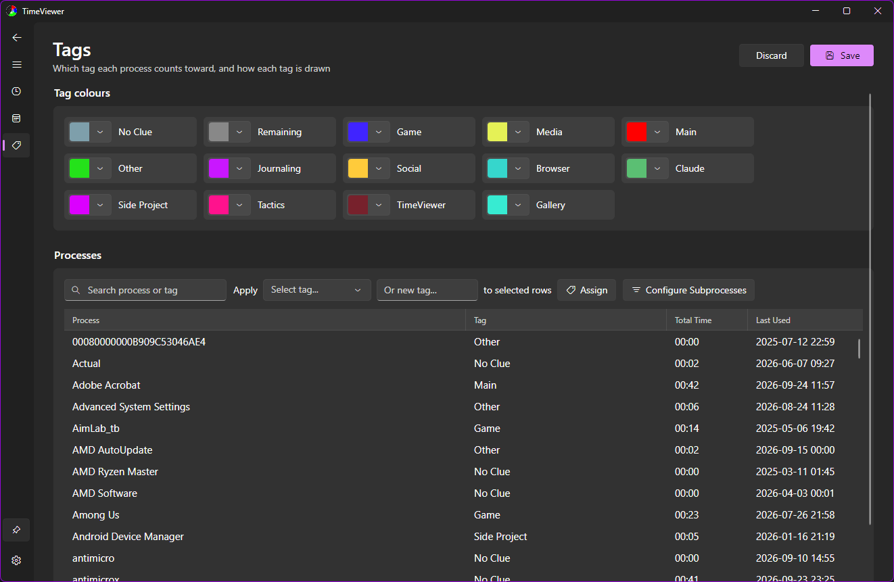
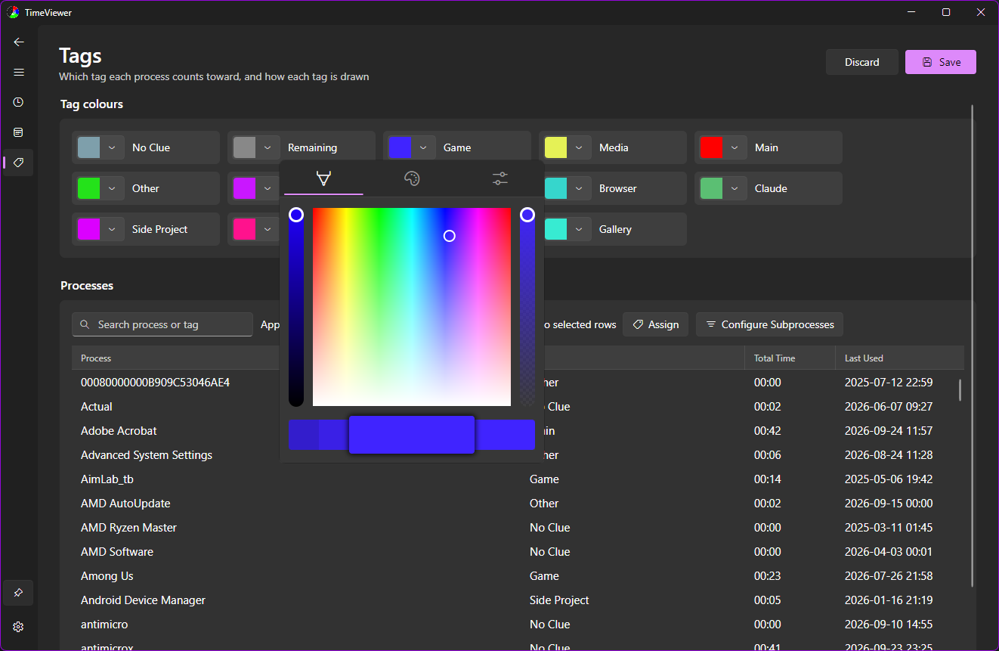
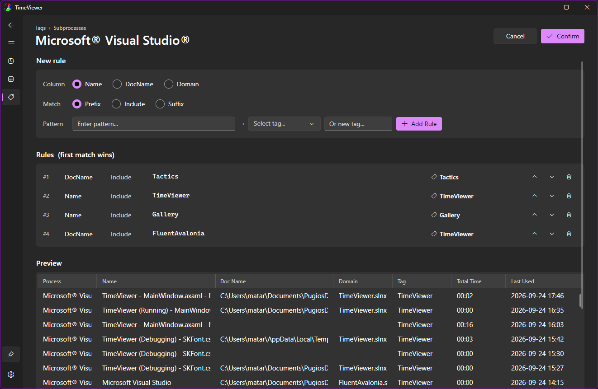
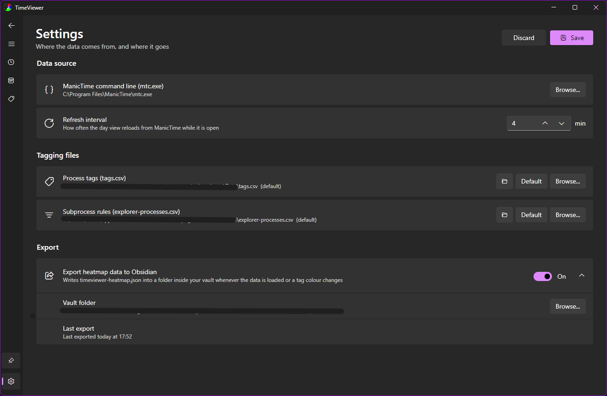

# TimeViewer

**See where your time on the PC actually goes, grouped the way *you* think about it.**

<picture>
  <source media="(prefers-color-scheme: dark)" srcset="./pics/TV1.png">
  
</picture>

I find it fascinating to discover patterns in everything, including my own life. TimeViewer is the
tool I built to observe my own behaviour and understand how I really spend each day at the computer.

It sits on top of [ManicTime](https://www.manictime.com/), which quietly records the active window
all day. ManicTime's own views make it hard to get a quick, honest answer to *"how long did I actually
work today?"*. TimeViewer answers it: you sort every app into your own categories (tags) once, and
from then on every day, week and year is broken down by them.

> **TimeViewer needs ManicTime.** It reads ManicTime's data through its command line tool
> (`mtc.exe`), so ManicTime has to be installed and tracking for TimeViewer to show anything.

## Features

### Day view
A nested pie chart of one day: your tags on the inside, the apps behind them on the outside, and the
total tracked time in the middle. Beneath it, a **24h timeline** shows *when* each thing happened,
with details on hover.

- "Today" shows the **rolling last 24 hours**, so the chart is never empty just after midnight
- Step back and forth by day or by week, or jump straight back to today
- Refreshes itself from ManicTime on a timer you choose (every 5 minutes by default)

### Statistics


A card per tag for the whole year:

- **Year Overview**: a GitHub-style heatmap, one cell per day
- **Active Hours**: a weekday × hour grid showing *when* in the week you spend time on that tag
- Each tag is shaded against its own year, so a dark cell means "a heavy day for this tag". Every
  card has its own legend with the real durations behind each shade
- Reorder the cards, or hide tags you don't care about. The layout is remembered

### Tags


Every process ManicTime has ever seen, with its total time and when it was last used.

- Search by process or tag, multi-select rows and assign a tag (or create a new one) in one go
- Pick each tag's colour with a full colour picker. The colours carry through to every chart



### Subprocess rules


Some apps are used for many things: a browser can be work or YouTube, an editor can be one
project or another. For those, you can split the app by **what it had open**:

- Match on the window name, the document name or the domain, by prefix, substring or suffix
- Rules are ordered and the first match wins. Reorder them any time
- A **live preview** shows exactly which activities each rule catches before you confirm

### Settings


- Point TimeViewer at `mtc.exe` and choose the refresh interval
- **Start with Windows**, optionally minimized to the taskbar. It is the same switch as Task
  Manager's *Startup apps* tab, so turning it off in either place turns it off in both
- Keep `tags.csv` and `explorer-processes.csv` wherever you like, for example in a synced folder
  shared between machines
- **Obsidian export**: write per-tag heatmap data into your vault on every refresh, with the time of
  the last export (or the reason it failed) shown right here. [More below](#obsidian-heatmap-export)

### And around it
- Fluent design with a navigation pane, following your **system light/dark theme and accent colour**
- **Keep on top** pin, handy for a small window in the corner of your screen
- Navigate back and forward with the mouse's thumb buttons
- All your data stays on your machine: plain CSV and JSON files you can read, edit and back up

## Getting started

1. Install [ManicTime](https://www.manictime.com/) and let it track for a while.
2. Download `TimeViewerSetup.exe` from the [latest release](https://github.com/Pugios/TimeManagement/releases/latest) and install it.
   Windows 10 (1809) or later, x64. The installer offers to start TimeViewer with Windows
   (on by default, and optionally minimized). You can change this later in Settings or Task Manager.
3. In **Settings**, check the path to `mtc.exe` (the default is `C:\Program Files\ManicTime\mtc.exe`).
4. Open **Tags**, sort the table by Total Time and start tagging your biggest apps. Anything you
   haven't tagged yet is counted under **No Clue**, so there's no need to do it all at once.

Your tags, rules and settings live in `%LOCALAPPDATA%\TimeViewer\com.pugio.timeviewer\Data`.

## Tech stack

TimeViewer is a .NET desktop app on a cross-platform UI stack, built entirely on free, open-source
libraries:

| | |
|---|---|
| Runtime | [.NET 10](https://dotnet.microsoft.com/), C# |
| UI framework | [Avalonia 12](https://avaloniaui.net/) |
| Design | [FluentAvalonia](https://github.com/amwx/FluentAvalonia) (WinUI-style Fluent controls, system theme and accent) |
| Charts | [LiveCharts2](https://livecharts.dev/) on SkiaSharp (pie, heatmaps) plus a custom-drawn timeline control |
| Architecture | MVVM with [CommunityToolkit.Mvvm](https://github.com/CommunityToolkit/dotnet) source generators and compiled bindings |
| Data | ManicTime CLI (`mtc.exe`) exports, parsed with [CsvHelper](https://joshclose.github.io/CsvHelper/) |
| Installer | [Inno Setup](https://jrsoftware.org/isinfo.php) |

TimeViewer started out as a .NET MAUI app. Version 1.0 is a full rewrite in Avalonia: a proper
desktop UI instead of a mobile-first one, no commercial component licences, and a path to Linux.
It reads the same files as the MAUI version, so an existing setup carries straight over. The MAUI
code is preserved at the [`maui-final`](https://github.com/Pugios/TimeManagement/tree/maui-final) tag.

### Building from source

```
cd TimeViewer
dotnet run                                            # develop
dotnet publish -c Release -r win-x64 --self-contained # then compile TimeViewer.iss for the installer
```

For the longer-term picture, [Analysis](./Analysis/) holds the Python scripts I used to find
trends before the Statistics page existed.

---

## Obsidian Heatmap Export

TimeViewer can write its per-tag heatmap data into an Obsidian vault, so the
[Heatmap Calendar](https://github.com/Richardsl/heatmap-calendar-obsidian) community plugin can
render a calendar per tag next to whatever else you already track there.

Enable it in **Settings**: pick a folder and flip the switch. The folder **must be inside the
vault** - dataviewjs' `dv.io.load()` resolves vault-relative paths only, so anything outside it is
unreachable from a note. TimeViewer then rewrites `timeviewer-heatmap.json` there every time it
loads data from ManicTime (either Reload button or the automatic refresh) and whenever a tag colour
changes. Settings shows when the file was last written, or why the last attempt failed. Dataview
notices the change and re-renders on its own; the two apps never talk directly.

### Format

Values are **seconds**, covering every year in your ManicTime data rather than just the year on
screen. `ramp` is the tag's own colour ramp as the app draws it, pale to saturated.
`thresholds` are the cut points between shades, **per year**, so a note can colour days exactly
the way the app does and label what each shade means.

```json
{
  "generatedAt": "2026-09-18T14:02:11+02:00",
  "unit": "seconds",
  "tags": {
    "Work": {
      "color": "#1872FF",
      "ramp": ["#99c1ff", "#6ea6ff", "#438cff", "#1771ff"],
      "thresholds": { "2026": [3600, 7200, 18000] },
      "days": { "2026-03-04": 10830, "2026-03-05": 10800 }
    }
  }
}
```

Two rules the numbers follow, shared with the pie chart and the timeline so every view agrees:
activities under 30s are ignored, and an activity crossing midnight counts wholly toward the day it
started on.

### How the shades are decided

Each tag is scaled **against its own days, within one year** - quartiles, not a linear split of the
maximum, so one exceptional day cannot wash out the whole year. A day lands in the first step it
fits under:

| step | covers | with `thresholds: [1h, 2h, 5h]` |
|---|---|---|
| 0 | nothing tracked | - |
| 1 | up to `thresholds[0]` | up to 1h |
| 2 | up to `thresholds[1]` | 1h - 2h |
| 3 | up to `thresholds[2]` | 2h - 5h |
| 4 | everything above | over 5h |

So a dark cell means *a heavy day for that tag*, not a fixed number of hours - which is exactly why
the legend below is worth drawing. Two consequences worth knowing: the scale differs between tags,
and a tag with only one or two active days produces tied quartiles, so some steps cover nothing and
their labels repeat.

### Rendering it, with a legend

Paste into any note, set `tag` and `year` to taste. This reproduces the app's own buckets, so the
note and the Statistics page agree cell for cell.

````markdown
```dataviewjs
const path = "TimeViewer/timeviewer-heatmap.json"
const tag  = "Work"
const year = 2026

const data = JSON.parse(await dv.io.load(path))
const t    = data.tags[tag]
const th   = t.thresholds[year] ?? []

// Mirrors HeatmapAggregator.Bucket: the first step the day fits under.
const bucket = (seconds) => {
    if (seconds <= 0) return 0
    for (let i = 0; i < th.length; i++) if (seconds <= th[i]) return i + 1
    return 4
}

// Mirrors HeatmapAggregator.FormatDuration: "45m", "3h", "1h20m".
const fmt = (s) => {
    const h = Math.floor(s / 3600)
    const m = Math.floor((s % 3600) / 60)
    if (h === 0) return `${Math.max(m, 1)}m`
    return m === 0 ? `${h}h` : `${h}h${m}m`
}

const labels = ["none", ...[1, 2, 3, 4].map(i =>
    th.length === 0        ? (i === 4 ? "any" : "")
  : i - 1 < th.length      ? `≤${fmt(th[i - 1])}`
  :                          `>${fmt(th[th.length - 1])}`
)]

renderHeatmapCalendar(this.container, {
    year,
    colors: { [tag]: t.ramp },
    showCurrentDayBorder: true,
    // The intensity IS the bucket, so the four ramp colours line up with steps 1-4.
    intensityScaleStart: 1,
    intensityScaleEnd: 4,
    entries: Object.entries(t.days)
        .filter(([date]) => date.startsWith(String(year)))
        .map(([date, seconds]) => ({
            date,
            intensity: bucket(seconds),
            color: tag,
        })),
})

// Legend: one swatch per step, labelled with the span of time it stands for.
const legend = this.container.createEl("div", { attr: {
    style: "display:flex; align-items:flex-end; gap:6px; margin-top:10px; flex-wrap:wrap;"
}})

labels.forEach((label, i) => {
    const cell = legend.createEl("div", { attr: {
        style: "display:flex; flex-direction:column; align-items:center; gap:3px;"
    }})
    cell.createEl("div", { attr: {
        style: `width:22px; height:22px; border-radius:4px; background:${
            i === 0 ? "var(--background-modifier-border)" : t.ramp[i - 1]};`
    }})
    cell.createEl("span", { text: label, attr: { style: "font-size:10px; opacity:0.7;" } })
})

// Hover: the exact time behind a cell, for every tag that recorded something that day.
// The plugin stamps data-date on each box that has an entry and styles the boxes
// position:relative, so the tooltip can simply hang off the box. Built on first hover
// rather than up front, so a note with many tags does not create thousands of nodes.
const fmtLong = (s) => {
    // Round to whole minutes FIRST, or 59.9 minutes renders as "60 min" instead of "1 h".
    const mins = Math.round(s / 60)
    const h = Math.floor(mins / 60)
    const m = mins % 60
    if (h === 0) return `${Math.max(m, 1)} min`
    return m === 0 ? `${h} h` : `${h} h ${m} min`
}

const buildTooltip = (box, date) => {
    const tip = box.createEl("div", { attr: { style: `
        position:absolute; bottom:calc(100% + 6px); left:50%; transform:translateX(-50%);
        z-index:20; width:max-content; pointer-events:none; white-space:nowrap;
        padding:6px 8px; border-radius:6px; font-size:11px; line-height:1.5; text-align:left;
        background:var(--background-secondary); color:var(--text-normal);
        border:1px solid var(--background-modifier-border);
        box-shadow:0 2px 8px rgba(0,0,0,0.25);` }})

    tip.createEl("div", { text: date, attr: { style: "font-weight:600; margin-bottom:3px;" } })

    const row = tip.createEl("div", { attr: {
        style: "display:flex; gap:12px; justify-content:space-between;"
    }})
    row.createEl("span", { text: tag, attr: { style: "opacity:0.75;" } })
    row.createEl("span", { text: fmtLong(t.days[date]) })

    return tip
}

this.container.querySelectorAll(".heatmap-calendar-boxes li[data-date]").forEach(box => {
    box.addEventListener("mouseenter", () => {
        box._tip = box._tip ?? buildTooltip(box, box.dataset.date)
        box._tip.style.display = "block"
    })
    box.addEventListener("mouseleave", () => {
        if (box._tip) box._tip.style.display = "none"
    })
})
```
````

To list what is available instead of hardcoding a tag: `Object.keys(data.tags)`.

### Hovering a day

The tooltip needs **no per-day notes**. The tag's daily seconds are already in the one JSON, so the
hover handler reads them straight out of `t.days[date]` - nothing is added to the vault. It reports
the tag the calendar is drawn for and nothing else; every other tag's numbers are in the same file
if you ever want a fuller breakdown.

It hooks the rendered grid rather than the plugin's `content` field, because `content` is meant for
a link element (that is what makes your happiness cells open their note) and lands as raw text
inside a ~12px box otherwise. The two things that make hooking the DOM safe are guaranteed by the
plugin itself: it stamps `data-date="YYYY-MM-DD"` on every box that has an entry, and its stylesheet
sets `.heatmap-calendar-boxes li { position: relative }`, so an absolutely positioned child sits
over the right cell. Days with nothing tracked get no `data-date` and so no tooltip, which is the
correct behaviour - there is nothing to report.

If you would rather have one line than thirty, the native browser tooltip works too, at the cost of
a delay and OS styling:

```js
this.container.querySelectorAll(".heatmap-calendar-boxes li[data-date]").forEach(box =>
    box.title = `${box.dataset.date}: ${fmtLong(t.days[box.dataset.date])}`)
```

> Verified against Heatmap Calendar **0.7.1**. That version maps intensity with
> `Math.round(map(intensity, scaleStart, scaleEnd, 1, colors.length))`, so `intensityScaleStart: 1`
> / `intensityScaleEnd: 4` over a four-colour ramp is the identity - bucket *n* gets shade *n*. If
> you upgrade and the shades shift, those two numbers are the only thing to adjust; the buckets,
> the legend and the tooltip are computed here and stay correct either way.
